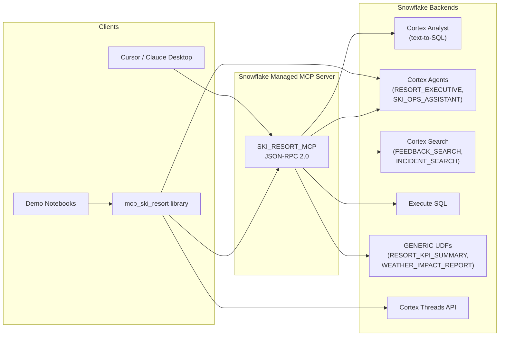

# MCP Ski Resort

> A Python client library for interacting with Snowflake Cortex Agents, Cortex Search, and Cortex Analyst — featuring Alpine Mountain Ski Resort analytics and a Managed MCP Server.


---

## Architecture



---

## Repository Structure

```
Snowflake-MCP/
├── 00_core.ipynb              # Library: JWT auth, SSE streaming, normalization, threads
├── 01_async.ipynb             # Library: Async transport (httpx)
├── 02_mcp_client.ipynb        # Library: MCP JSON-RPC client & display helpers
├── 03_agent_streaming.ipynb   # Demo: Cortex Agent streaming & conversations
├── 04_mcp_client.ipynb        # Demo: MCP Server tools via JSON-RPC
├── index.ipynb                # nbdev README source
├── mcp_ski_resort/            # Python package (auto-generated by nbdev-export)
│   ├── __init__.py
│   ├── core.py
│   ├── astream.py
│   ├── mcp_client.py
│   └── _modidx.py
├── sql/
│   ├── 00_create_cortex_search.sql
│   ├── 01_create_custom_tools.sql
│   └── 02_create_mcp_server.sql
├── tests/
│   ├── test_agent_streaming.py
│   ├── test_mcp_client.py
│   └── test_mcp_server.sh
├── pyproject.toml
├── .env.example               # Credential template (copy to .env)
├── .pre-commit-config.yaml    # Secret scanning hooks
├── mcp.json.example           # MCP client config template
├── PREREQUISITES.md           # Snowflake setup guide
├── CONTRIBUTING.md            # nbdev workflow guide
└── _quarto.yml                # Documentation config
```

---

## Library Modules

| Module | Notebook | Highlights |
|--------|----------|------------|
| `mcp_ski_resort.core` | `00_core` | JWT auth, `SnowflakeSession`, `stream_agent_sse`, `normalize_event`, `run_agent`, `AgentChat`, `create_thread`, thread-mode conversations |
| `mcp_ski_resort.astream` | `01_async` | Async equivalents via `httpx`: `async_run_agent`, `AsyncAgentChat`, `async_stream_agent_sse`. Install with `pip install mcp-ski-resort[async]` |
| `mcp_ski_resort.mcp_client` | `02_mcp_client` | MCP JSON-RPC client (`MCPClient`, `mcp_call`, `display_mcp_result`) |

---

## Demo Notebooks

| Notebook | Description |
|----------|-------------|
| `03_agent_streaming` | One-shot calls, multi-turn `AgentChat`, thread mode, custom streaming, working with `AgentResult` |
| `04_mcp_client` | Discover tools, call all 5 MCP tool types, `MCPClient` class usage |

---

## MCP Server Tool Inventory

The Alpine Mountain MCP Server (`SKI_RESORT_MCP`) exposes 10 tools across 5 Snowflake tool types:

| Tool Name | Type | Param | Description |
|---|---|---|---|
| `daily-summary-analyst` | CORTEX_ANALYST_TEXT_TO_SQL | `message` | Natural-language queries over daily operations |
| `revenue-analyst` | CORTEX_ANALYST_TEXT_TO_SQL | `message` | Revenue and financial analytics |
| `operations-analyst` | CORTEX_ANALYST_TEXT_TO_SQL | `message` | Operational metrics and staffing |
| `resort-executive-agent` | CORTEX_AGENT_RUN | `text` | Executive-level resort analysis agent |
| `ski-ops-assistant-agent` | CORTEX_AGENT_RUN | `text` | Operational assistant for ski operations |
| `feedback-search` | CORTEX_SEARCH_SERVICE_QUERY | `query` | Semantic search over guest feedback |
| `incident-search` | CORTEX_SEARCH_SERVICE_QUERY | `query` | Semantic search over safety incidents |
| `execute-sql` | SYSTEM_EXECUTE_SQL | `sql` | Ad-hoc SQL execution |
| `resort-kpi-summary` | GENERIC | `p_season` | Resort KPI summary UDF |
| `weather-impact-report` | GENERIC | `p_start_date`, `p_end_date` | Weather impact analysis UDF |

---

## Quick Start

### 1. Clone and install

```bash
git clone <repo-url>
cd Snowflake-MCP
python -m venv .venv
source .venv/bin/activate
pip install -e ".[dev]"
```

### 2. Configure credentials

```bash
cp .env.example .env
# Edit .env with your Snowflake account details
```

Your `.env` must contain:

```
SNOWFLAKE_ACCOUNT=your_account_locator
SNOWFLAKE_USER=your_username
SNOWFLAKE_ROLE=your_role
SNOWFLAKE_PRIVATE_KEY_PATH=~/path/to/your/key.p8
```

### 3. Create Snowflake objects

Run the SQL scripts in order against your Snowflake account:

```bash
# In Snowflake worksheet or CLI:
sql/00_create_cortex_search.sql   # Cortex Search services
sql/01_create_custom_tools.sql    # UDFs for GENERIC tools
sql/02_create_mcp_server.sql      # MCP Server definition
```

### 4. Use the library

```python
from mcp_ski_resort.core import run_agent, AgentChat, create_thread

# One-shot call
result = run_agent("RESORT_EXECUTIVE", "How did we perform this season?")
print(result.answer)

# Multi-turn conversation (local history)
chat = AgentChat("RESORT_EXECUTIVE")
chat.ask("What are our top KPIs?")
chat.ask("Compare with last season")  # history sent automatically

# Multi-turn with server-side threads
tid = create_thread()
chat = AgentChat("RESORT_EXECUTIVE", thread_id=tid)
chat.ask("What are our top KPIs?")  # server owns continuity
```

### Async

```bash
pip install -e ".[async]"
```

```python
from mcp_ski_resort.astream import async_run_agent, AsyncAgentChat

result = await async_run_agent("RESORT_EXECUTIVE", "Season summary")
```

### MCP client

```python
from mcp_ski_resort.mcp_client import mcp_tools_list, mcp_call, display_mcp_result

tools = mcp_tools_list()
resp = mcp_call("resort-executive-agent", {"message": "Season summary"})
display_mcp_result(resp, label="Executive Summary")
```

### 5. Run demo notebooks

```bash
jupyter lab
# Open 03_agent_streaming.ipynb or 04_mcp_client.ipynb
```

---

## Authentication

This project uses **RSA key-pair JWT authentication** for all Snowflake REST API calls.

1. Generate an RSA key pair and register the public key with your Snowflake user
2. Set `SNOWFLAKE_PRIVATE_KEY_PATH` in `.env` to point to your `.p8` private key file
3. The `JWTGenerator` class in `core.py` handles token generation and caching

For MCP client tools (Cursor, Claude Desktop), you can also use **PAT (Personal Access Token)** or **OAuth** authentication. See `mcp.json.example` for the client configuration template.

---

## MCP Client Configuration

To use the MCP Server from Cursor, Claude Desktop, or other MCP-compatible tools, copy `mcp.json.example` and fill in your credentials:

```json
{
  "mcpServers": {
    "ski-resort": {
      "url": "https://<account>.snowflakecomputing.com/api/v2/databases/AM_SKI_RESORT/schemas/MCP_SERVERS/mcp-servers/ski_resort_mcp",
      "headers": {
        "Authorization": "Bearer <your-pat-token>",
        "X-Snowflake-Authorization-Token-Type": "PROGRAMMATIC_ACCESS_TOKEN"
      }
    }
  }
}
```

---

## Testing

```bash
# Run nbdev tests (skips cells marked #| eval: false)
nbdev-test

# Run live integration tests (requires .env credentials)
python tests/test_agent_streaming.py
python tests/test_mcp_client.py

# Run a single test by number
python tests/test_mcp_client.py 1    # tools/list only
python tests/test_agent_streaming.py 2  # agent streaming only
```

---

## Key Technical Details

### Conversation Modes

- **Local-history mode** (default): `AgentChat` sends full conversation history with each request. The caller owns continuity.
- **Thread mode**: Pass `thread_id` to `AgentChat` or `run_agent`. The server-side Cortex Thread owns continuity. Local history is still recorded for inspection/debugging but is not sent upstream. `parent_message_id` advances automatically from `metadata` SSE events.

### Event Normalization

Raw SSE events from the Cortex Agent `:run` endpoint are normalized into a consistent `{"event": str, "data": dict}` format by `normalize_event()`. The private `_iter_raw_and_normalized_agent_events()` driver owns the single `seen_tool_result` state machine — all higher-level functions (`iter_normalized_agent_events`, `collect_agent_events`, `run_agent`) build on this to avoid duplicated normalization logic.

### Response Formats

- **Cortex Agent SSE**: Server-Sent Events with `event:` and `data:` fields. Events include `response.text.delta`, `response.tool_use`, `response.tool_result`, `response.chart`, `response.error`, `metadata`, and `done`.
- **MCP JSON-RPC**: Standard JSON-RPC 2.0 with `method: "tools/call"` and `params: {name, arguments}`.
- **Result set column names**: Located at `resultSetMetaData.rowType[].name` (not `columns[]`).

### GENERIC Tool Configuration

GENERIC tools in the MCP Server map to Snowflake UDFs. The MCP Server auto-discovers UDF parameters and exposes them as tool arguments. Return type `OBJECT` is recommended for structured results.

---

## nbdev Development

This project is built with [nbdev](https://nbdev.fast.ai/). The notebooks are the **single source of truth** — never edit `.py` files directly.

```bash
nbdev-export     # Generate .py files from notebooks
nbdev-test       # Run notebook tests
nbdev-prepare    # Export + test + clean (run before commits)
```

See [CONTRIBUTING.md](CONTRIBUTING.md) for the full development workflow.
